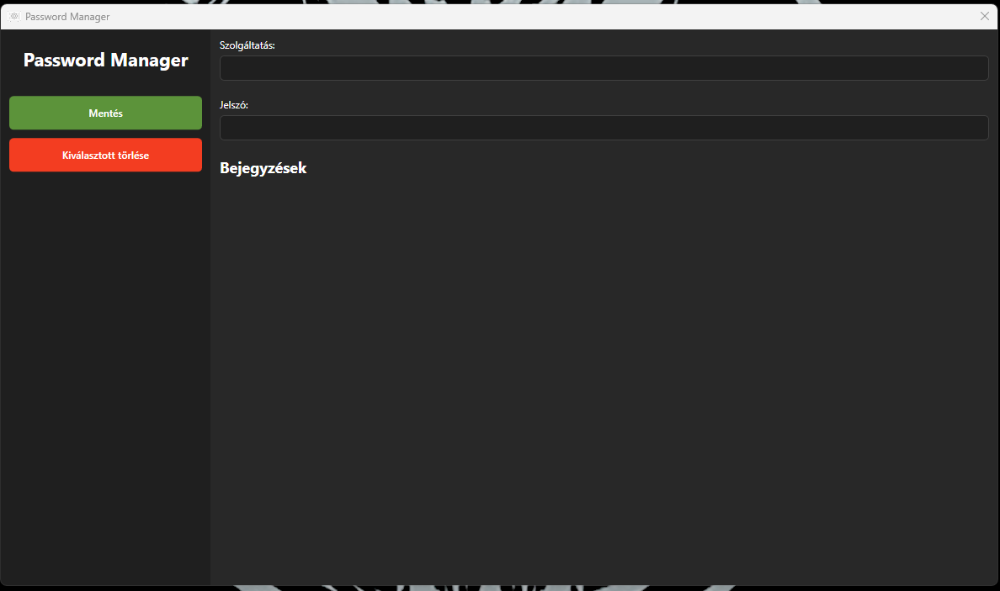
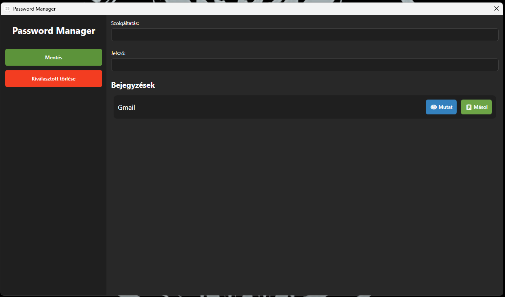
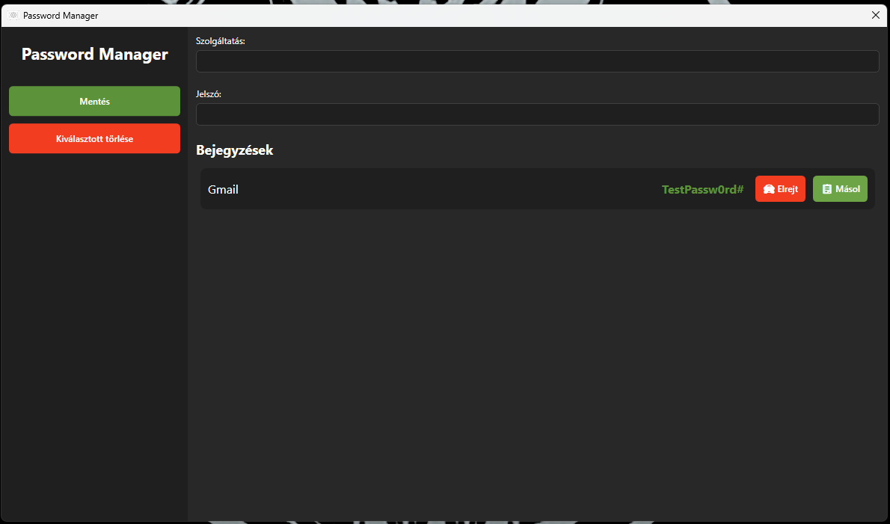
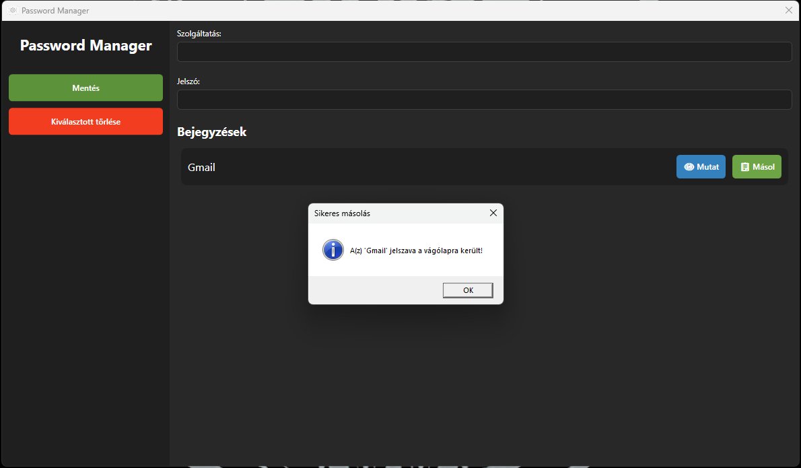

# Password-Manager

A simple, secure, and user-friendly password manager application built with WPF and SQLite. Designed to provide an easy way to store and manage credentials locally.

---

## 📖 Áttekintés / Overview

**Magyar:**
Ezt az alkalmazást azért hoztam létre, hogy a szüleimnek könnyebbé tegyem a mindennapjait. Idősként sokszor nehézséget okozott a jelszavak fejben tartása, így ezzel a WPF alapú szoftverrel egyszerűen tárolhatják, megtekinthetik és törölhetik az adataikat. A biztonság érdekében a jelszavak az SQLite adatbázisban titkosítva kerülnek eltárolásra.

**English:**
This application was created for my parents, who often struggled with remembering their various passwords. It provides a straightforward interface to save, view, copy, and delete credentials. Security is ensured through local database encryption.

---

## 🚀 Funkciók / Features

* **Egyszerű kezelőfelület / Simple Interface:** Könnyen átlátható és intuitív kialakítás.
* **Titkosított adattárolás / Encrypted Storage:** Az adatok biztonságosan, SQLite adatbázisban tárolódnak.
* **Gyors másolás / Quick Copy:** A jelszavak egy kattintással a vágólapra másolhatók.
* **Bejegyzések kezelése / Manage Entries:** Bejegyzések létrehozása, megtekintése és törlése.

---

## 📸 Képernyőképek / Screenshots

| Kezdőképernyő / Main Screen | Bejegyzés hozzáadása / Add Entry |
| :---: | :---: |
|  |  |
| **Jelszó mutatása / Show Password** | **Törlés / Delete Entry** |
|  |  |

---

## 🛠 Technikai részletek / Tech Stack

* **Framework:** WPF (.NET)
* **Adatbázis / Database:** SQLite
* **Titkosítás / Encryption:** Local encryption implementation

---

## 💡 Használat / How to use

1.  **Mentés:** Írd be a bejegyzés nevét és a jelszót, majd nyomd meg a "Mentés" gombot.
2.  **Megtekintés:** Jelölj ki egy elemet a listában, és kattints a "Mutat" gombra.
3.  **Másolás:** A "Másol" gombbal másold a jelszót a vágólapra.
4.  **Törlés:** Jelölj ki egy bejegyzést, majd töröld, ha már nincs rá szükség.

---
*Megjegyzés: Az alkalmazást személyes igények alapján, saját használatra fejlesztettem.*
